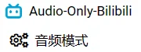

	

# audio-only-bilibili.js

随便用用~

参考 [Audio Only bilibili](https://github.com/cyio/audio-only-bilibili) 扩展写的油猴脚本。

打开B站视频页面后，点击油猴脚本菜单的按钮：

即可切换为音频播放模式。

再次点击菜单按钮会刷新页面，页面刷新之后就会恢复正常。

[点击安装](https://github.com/monSteRhhe/audio-only-bilibili.js/raw/main/audio-only-bilibili.user.js)

> 目前仅适用于B站使用 AVC 编码的视频播放器。

**参考**

[Audio Only bilibili](https://github.com/cyio/audio-only-bilibili)

[bilibili-API-collect](https://github.com/SocialSisterYi/bilibili-API-collect)
